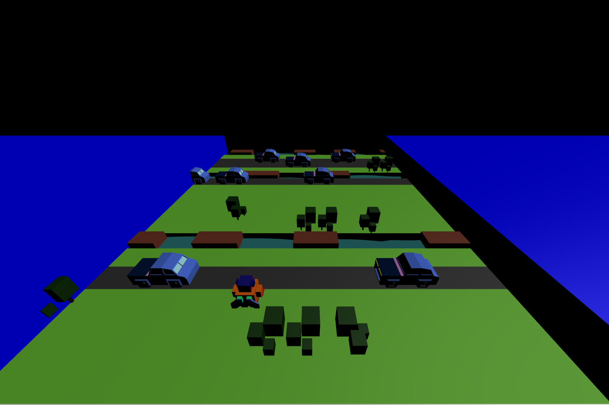

# Golden rule app

> Copy of popular game Crossy Road made with three.js library. Results are stored in firestore added and readed by cloud functions.

Training project. May contain bugs, and bad graphics.

Controlls WSAD [live](https://crossyroadwannabe.web.app/)

## Table of contents

- [General info](#general-info)
- [Screenshots](#screenshots)
- [Technologies](#technologies)
- [Features](#features)
- [Contact](#contact)

## General info

Game is copy of CrossyRoad (or Frogger) it contains 3d graphics made in blender. Three.js is used to handle 3d graphics and character movement. You can store your results in firestore.

## Screenshots

## Technologies

- three.js

## Features

- character movement and collisions.
- randomly generated map.
- rafts that transport characters.
- driving cars that destroys character.
- high score table.

## Contact

Created by [KrissDrawing](https://krissdrawing.pl/) - feel free to contact me!
